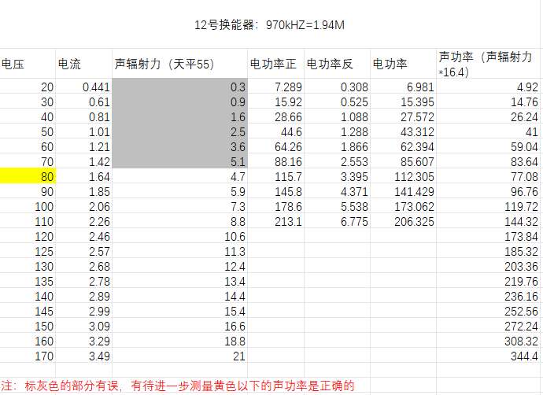
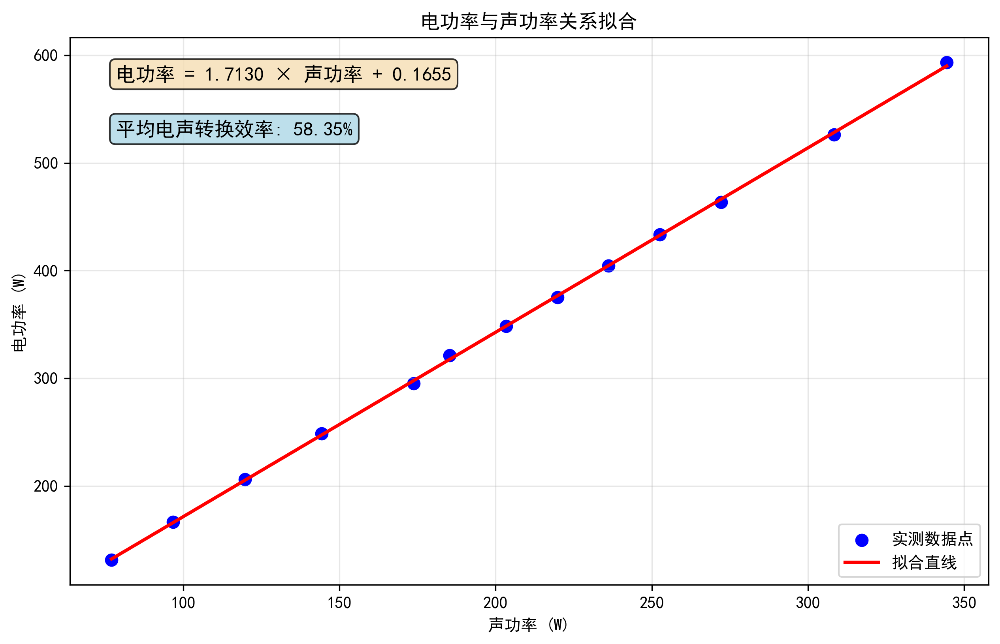

# 1 理论推导

## 1.1 声辐射力测量声功率计算

**声辐射力天平测量的是总声功率**,辐射力与换能器声功率的关系如下：

```matlab
% 对于全吸收靶
W = cF;
% 对于全反射靶
W = cF /（2cosθcosθ）
```

P为声功率，单位是W，F辐射力，单位为N，c为声束在介质中的传播速度，单位是m/s。

θ是入射波传播方向与反射面法线之间的夹角，单位是rad或者度。

## 1.2 声强计算

声强是单位时间内垂直通过单位面积的声能量，对于平面余弦波，声强与声压平方成正比，与频率平方成正比，可以理解为单位面积上的声功率。其单位是焦耳/（秒·平方米）[$J/(s·m^2)$]

$I_{声强} = \frac{1}{2}\rho c A^2 \omega ^2 = P_{rms}^2/{\rho c}$

​	由于声强可以通过声功率除以接收面积来获得，通过上述声强与声辐射力测量可以建立联系

​	声强	$I = W_{声功率}/S_{接收面积}$，由$I_{声强} = P_{声压}^2/{\rho c}$

​	可得	$P = sqrt(\rho * c * W_{声功率}/S _{接收面积})$

### 1.3 仿真换能器的发射波幅值设置：

而对于换能器，整个换能器的面积为接收面积，在水中ρ与c已知，已知W声功率情况下可以计算出P声压值，此时计算得到的声压值amp即作为声波的幅值带入。

即$P_{声波幅值} = sqrt(\rho * c * W_{声功率}/S _{换能器面积})$

其中$P \propto W$，随W声功率增大，P增大

​	$P_{rms} * \sqrt{2} = P_{peak}$

可得发射声波幅值为$P_{peak} = sqrt(2*\rho * c * W_{声功率}/S _{换能器面积})$

# 2. 实际仿真幅值及声功率、电功率计算

## 2.1 幅值计算

由上述理论知识推导可知

```matlab
UserSet.source_amp = 1e5;	% 幅值 仿真设置的参数大小
c = 1540;                   		% 声速m/s
rho = 1000;                 	     % 密度kg/m3
Area = 0.038;               	     % m²(仿真实验室换能器探头的发射面的表面积)
get_source_power = UserSet.source_amp ^2 * Area/(2 * c * rho);
fprintf('%d\n',get_source_power);	% 计算得到的声功率
```

得到声功率约为$123.38W$

## 2.2 声功率-电功率线性拟合

实验室测试数据如下



电功率与声功率进行线性拟合得到如下所示



拟合方程: $W_{电功率 }= 1.7130 × W_{声功率 } + 0.1655$

得到电功率约为$211.511W$

## 1.4 对于组织内的声功率计算：

声功率是声波在单位时间内通过某一截面的总能量，需要通过**积分**计算：

$W = \iint_S I(x,y) \, dA = \iint_S \frac{P^2(x,y)}{\rho c} \, dA$

| 参数         | 符号   | 描述                     | 单位                |
| :----------- | :----- | :----------------------- | :------------------ |
| **声功率**   | W      | 通过截面的总声功率       | 瓦特 [W]            |
| **声强**     | I(x,y) | 位置(x,y)处的声强        | 瓦特/平方米 [W/m²]  |
| **声压**     | P(x,y) | 位置(x,y)处的声压        | 帕斯卡 [Pa]         |
| **介质密度** | ρ      | 组织或介质的密度         | 千克/立方米 [kg/m³] |
| **声速**     | c      | 介质中的声速             | 米/秒 [m/s]         |
| **面积微元** | dA     | 积分面积微元             | 平方米 [m²]         |
| **网格间距** | Δx, Δy | 仿真网格在x和y方向的间距 | 米 [m]              |
| **网格点数** | Nₓ, Nᵧ | x和y方向的网格点数       | 无量纲              |

